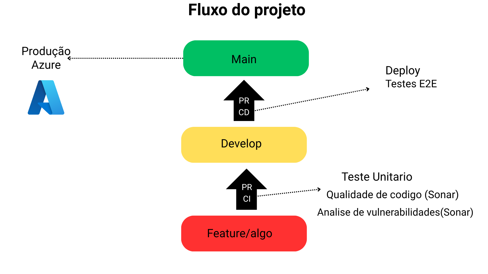

# Projeto-P2_Grupo9
# Membros
  <h4>Gabriel Araujo Santos RA: 2508678</h4>
  <h4>Paulo André Silva de Lima RA: 2512630</h4>
  <h4>Paulo Vitor Macieira Carvalho RA: 2508725</h4>
  <h4>Leonardo da Graça Moraes RA: 2512238</h4>
  
# Link do site
```
https://autoprime-app-grupo9.azurewebsites.net/
```

# Tema
<h4>Loja de venda de veiculos</h4>

# Fluxo do projeto


# Estrutura do projeto

## Public
- Assets -> imagens, ícones e outros arquivos estáticos
- Pages -> páginas do site (login, signUp, buy)
- JS -> JavaScript das páginas
- CSS -> estilos do site
- index.html -> página principal

## Raiz do Projeto
- server.js -> servidor Node/Express
- package.json -> dependências
- cypress.config.js -> configuração de testes E2E
- sonar-project.properties -> configuração SonarQube
- README.md -> este arquivo

## Cypress
- e2e/ -> testes end-to-end
- fixtures/ -> dados de teste
- support/ -> helpers e configurações

### Boas Práticas
- CSS global padrão que herda pra todas as páginas
- CSS próprio para cada página (responsivo e específico)
- JS próprio para cada página (não poluem o escopo global)
- Fonte Roboto (pega automaticamente do global.css)

# Link do Wireframe
<h4>wireframe alta fidelidade</h4>

```
https://www.figma.com/design/rvlKbO0Irhl70Mqbs2ljkR/Sem-t%C3%ADtulo?node-id=0-1&t=WjqkpVNRxQKXWTHr-1
```
# Estrutura de Branches DevOps
- main → produção (código estável)
- develop → base do desenvolvimento
- feature/* → cada funcionalidade nova
- bugfix/* → correções
- release/* → preparação pra versão
<<<<<<< HEAD
=======

## Como funciona o projeto
1. Feature nova PR pra develop
2. No meio do PR entre feature e develop vai rolar o teste do sonarqube
3. Develop -> Main
4. Teste E2E em produçao

# Feramentas utilizadas
- Sonarqube
- Git/Github/Github Actions
- HTML
- CSS
- NODE 
- Express
- Bootstrap
- Cypress
- Azure